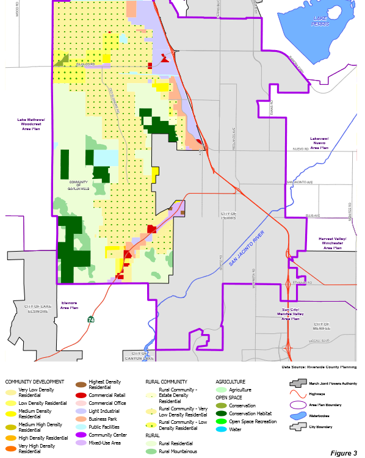
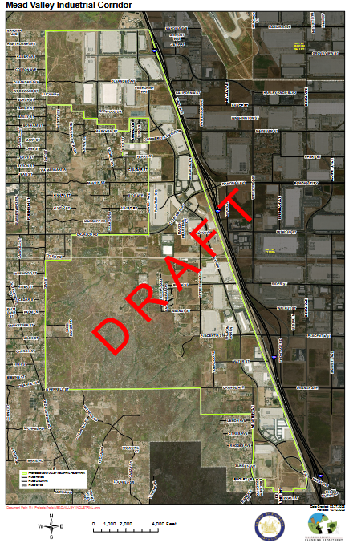
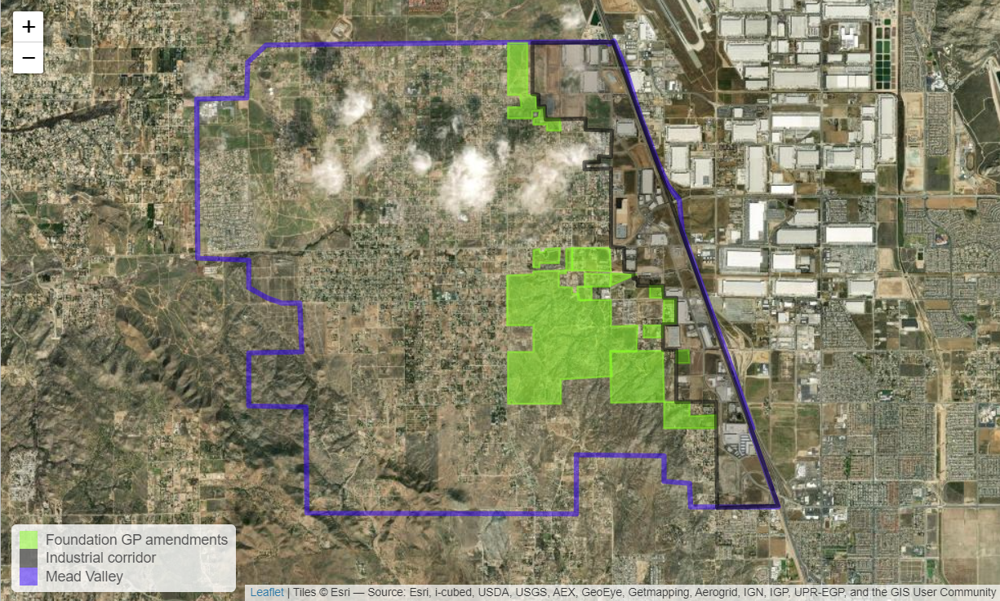

# EJ Case Study - Warehouse Projects in Mead Valley {#sec-EJPolygons}

::: {.callout-note appearance="simple"}
Today we will focus on an Environmental Justice Case Study in the unincorporated community of Mead Valley.  
:::

There is an unincorporated community in the County of Riverside called Mead Valley that has about 19,200 residents that has among the highest concentration of warehouse space per capita of any place in the Inland Empire.  Here is some [census info](https://censusreporter.org/profiles/16000US0646646-mead-valley-ca/) on Mead Valley.

The County is currently undergoing an 8-year planning cycle to amend the General Plan for land use called the [Foundation Amendment Cycle](https://planning.rctlma.org/2024-general-plan-foundation-amendment-cycle#2741959481-4202596112).  

I want to make a map to show all the planned changes and indicate how the area is going to change. Also, I'd like us to update the [wiki page on Mead Valley](https://en.wikipedia.org/wiki/Mead_Valley,_California).  

## Existing Conditions

The Mead Valley Area Plan is part of the Riverside County General Plan.  A picture of the land use planning is shown in that document in @fig-siteMap.  

{#fig-siteMap}
Industrial development is focused around the 215 freeway corridor to the East of the Mead Valley Planning area. The County is proposing to increase the industrial zoning by adding an industrial overlay, as shown in @fig-industrialoverlay.

{#fig-industrialoverlay}

This overlay is paving the way for multiple individual industrial projects proposed as part of the Foundation General Plan Amendment process.  

## Visualization 

Let's create a version of the map that illustrates the Mead Valley industrial overlay process.  

### Load libraries

```{r}
#| label: load libraries
#| warning: false
#| echo: true
#| output: false

library(sf)
library(leaflet)
library(dplyr)
library(tigris)
```

### Download Mead Valley boundary from tigris

The `tigris` package allows us to access US census geospatial data, including place boundaries and roads.

```{r}
#| label:  Place boundary from tigris
#| warning: false
#| echo: true
#| message: false
#| output: false

CA_places <- places(state = 'CA', cb = TRUE, year = 2025)

```
This downloads all 1,619 California cities, towns, and census designated places.  

```{r}
#| echo: true

head(CA_places)

```

```{r}
#| label: Mead Valley Polygon
#| warning: false
#| echo: true

MV <- CA_places |> 
  filter(NAME == 'Mead Valley') # keep only Mead Valley.  
#if you want multiple jurisdictions, replace == with %in% and use c() to create a list to select


```

Let's look at Mead Valley in leaflet with a basic visualization to make sure we've got the right place.

```{r}
#| label:  Mead Valley
#| warning: false
#| echo: true

leaflet() |> 
  addTiles() |> 
  addPolylines(data=MV) 
```


### Create your own Industrial overlay polygon (not really).

Open [Google Maps](https://www.google.com/maps) or an equivalent mapping tool with satellite imagery and an ability to click on a location and retrieve a decimal degree location.

Find a vertex on the map - input longitude and latitude into a list in the form `c(lng, lat)`.

Do that for all the vertex points and bind them together as a list of lists as shown in the code below.


```{r}
#| label:  List of vertices for Mead Valley
#| warning: false
#| echo: true

MV_ind2 <- rbind(
  c(-117.2788, 33.86607),
  c(-117.2618, 33.86621),
  c(-117.2556, 33.85206),
  c(-117.2345, 33.80283),
  c(-117.2349, 33.80164),
  c(-117.2368, 33.80158),
  c(-117.2368, 33.80113),
  c(-117.2404, 33.80116),
  c(-117.2403, 33.80172),
  c(-117.2418, 33.80172),
  c(-117.2418, 33.80292),
  c(-117.2437, 33.80295),
  c( -117.2441, 33.80416),
c(-117.2438, 33.80592),
c( -117.2439, 33.81224),
c( -117.2527, 33.81211),
c( -117.2526, 33.81574),
c( -117.2788, 33.81552),
c( -117.2790, 33.83360),
c( -117.2746, 33.83364),
c( -117.2746, 33.83728),
c( -117.2663, 33.83735),
c( -117.2616, 33.83737),
c( -117.2615, 33.84821),
c( -117.2658, 33.84832),
c( -117.2658, 33.85007),
c( -117.2615, 33.85005),
c( -117.2614, 33.85370),
c( -117.2647, 33.85371),
c( -117.2648, 33.85192),
c( -117.2671, 33.85189),
c( -117.2671, 33.85272),
c( -117.2701, 33.85275),
c( -117.2702, 33.85365),
c( -117.2745, 33.85368),
c( -117.2745, 33.85548),
c( -117.2788, 33.85556),
c( -117.2788, 33.86607)
)
```

Look at the `MeadValley` table in your Environment panel - it looks like a table of point coordinates.

We need one more bit of code to convert that into a polygon. It is complicated.

```{r}
#| label:  Convert list to polygon for Mead Valley
#| warning: false
#| echo: true

MV_Ind_overlay <- st_sf(
                      name = 'Mead Valley', 
                      geom = st_sfc(st_polygon(list(MV_ind2))), 
                      crs = 4326
                      )
```

The `name` is our label for the polygon, so that's easy. The `crs` is the coordinate reference system, in this case WGS84 = 4326 for easy display in `leaflet`.

The `geom` is the geometry. Three functions are applied - `list()` which converts the MeadValley table to a list, `st_polygon()` which returns a polygon from a list of coordinates, and `st_sfc()` which verifies the contents and sets its class.

::: {.callout-note appearance="simple"}
Polygons always have to start and end with the same vertex to be a closed loop.
:::

Now we should display it to make sure it looks correct. @fig-MeadValley shows the polygon with a basic map.

```{r}
#| label: fig-MeadValley
#| fig-cap: Mead Valley Polygon Check
#| echo: true

leaflet()  |>  
  addTiles() |> 
  addPolygons(data = MV_Ind_overlay)
```

That looks pretty good, although I skipped a couple of wiggles.

Now let's do a modification of the basic map using `addPolylines()` instead of `addPolygons()` and showing you how to add a few warehouses.  

Now let's add a warehouse layer showing all planned and approved warehouse projects within California that went through CEQA review from 2020-2024.

First import the warehouse dataset.  Let's name this dataset **warehouses**, just like we did in 8.3.2.2.

```{r}
#| echo: true
#| warning: false

WH.url <- 'https://raw.githubusercontent.com/RadicalResearchLLC/WarehouseMap/main/WarehouseCITY/geoJSON/comboFinal.geojson'
warehouses <- st_read(WH.url) |>  
  st_transform(crs = 4326) |> 
  filter(county == 'Riverside County')
```

Now let's add the existing warehouses to the map. 

@fig-addWH

```{r}
#| label: fig-addWH 
#| fig-cap: Mead Valley warehouses in bigger context with less busy map.
#| echo: true
#| eval: true

palWH <- colorFactor(palette = c('darkred', 'orange', 'black'),
                     domain = warehouses$category)

leaflet() |> 
  addTiles() |> 
  addPolylines(data = MV_Ind_overlay,
              color = 'blue',
              weight = 5) |> 
  addPolygons(data = warehouses,
              color = ~palWH(category), 
              weight = 1) |> 
  setView(zoom = 12, lat = 33.85, lng = -117.2) ## Add zoom level and map center point
```


@fig-providerTile

```{r}
#| label: fig-providerTile
#| fig-cap: Mead Valley warehouses zoomed just to the local area with a satellite image tile map
#| echo: true
#| eval: true

leaflet() |> 
  addProviderTiles(provider = providers$Esri.WorldImagery) |> ## We modified this line to change to satellite view  
  addPolylines(data = MV) |> 
  addPolylines(data = MV_Ind_overlay,
              color = 'chartreuse',
              weight = 3) |> 
  addPolygons(data = warehouses,
              color = ~palWH(category),
              weight = 1,
              fillOpacity = 0.6) |> 
  addLegend(data = warehouses,
            pal = palWH,
            values = ~category) |> 
  setView(zoom = 12, lat = 33.85, lng = -117.25) 
```

### Planned Warehouses map for Mead Valley Foundation plan amendments


@fig-amendments  

{#fig-amendments}


