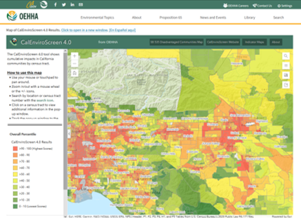
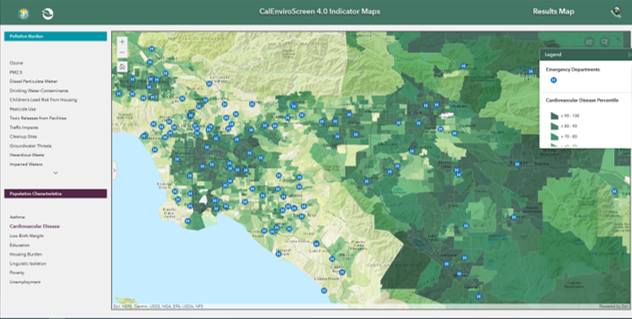
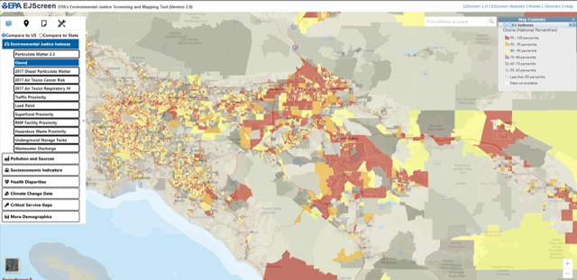
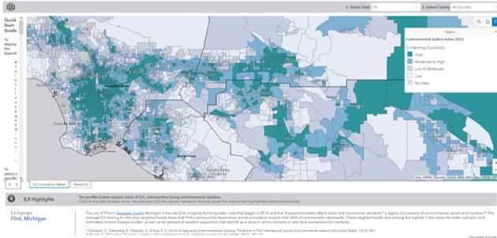
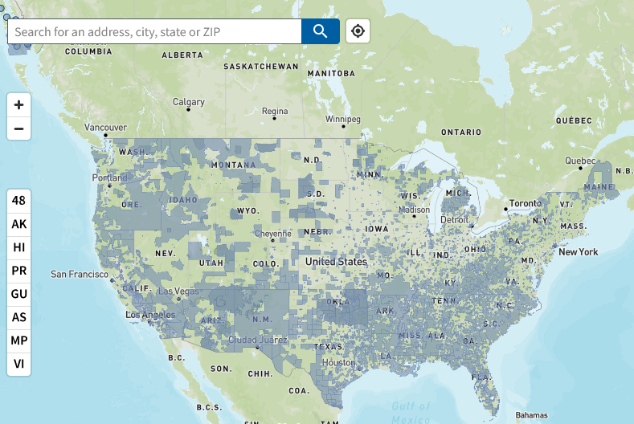

# EJ - Screening Tools {#sec-EJtheory}

::: {.callout-note appearance="simple"}
Today we will focus on the definition(s), theory, tools, and visualization of Environmental Justice
:::

## Definitions

-   [Environmental Protection Agency](https://19january2021snapshot.epa.gov/environmentaljustice/learn-about-environmental-justice_.html)  and California EPA - The fair treatment and meaningful involvement of all people regardless of race, color, culture, national origin, income, and educational levels with respect to the development, implementation, and enforcement of protective environmental laws, regulations, and policies. *Fair treatment* means that no population, due to policy or economic disempowerment, is forced to bear a disproportionate burden of the negative human health or environmental impacts of pollution or other environmental consequences resulting from industrial, municipal, and commercial operations or the execution of federal, state, local, and tribal programs and policies

-   Schlosberg et al., 2002 - - The equitable distribution of environmental risks and benefits

-   The difference between *Environmentalism* and *Environmental Justice* is that Environmental Justice brings forward the underlying issues of race, ethnicity, class, wealth, and/or sovereignty in environmental decision-making.

## Concepts of Environmental Justice Movement

The Environmental Justice is a broad and diffuse global movement with many facets. We will not be able to cover most of these concepts in-depth due to time constraints and the visualization focus of this course.

I did want to do an overview of these topics such that we can compare them to the current tools used in the U.S. and California for measuringing and quantifying Environmental Justice.

-   **Environmental Racism** - racial discrimination in environmental policy making, enforcement, and decision-making. This applies both within the United States and globally (e.g., hazardous waste export to southern hemisphere).
-   **Ecological debt** - the accumulation of obligations through inequitable resource exploitation, pollution, and habitat degradation between the Northern and Southern hemisphere. This has been quantified through **climate debt** which examines emissions differentials in carbon budgets and adaptation costs which will accrue primarily to poorer countries.
-   **Climate justice** - equitable distribution of benefits and burdens of climate change adaptation and costs.
-   **Food sovereignty** - a food system in which the people who produce, distribute, and consume food also control the mechanisms and policies of food production and distribution; this stands in contrast to a corporate food regime in which corporations and market insitutions control the food system.\
-   **Sacrifice Zones** - a geographic area permanently impaired by heavy environmental alterations or economic disinvestment, often through locally unwanted land use *(LULU)*.
-   **Environmentalism of the poor** - social movement that emphasizes social justice issues instead of emphasizing conservation and eco-efficiency; focuses on sustainability and sovereignty.

## Environmental Justice Tools

We are going to be talking about four EJ tools in this course.

-   [CalEnviroScreen5.0](https://oehha.ca.gov/calenviroscreen/report/calenviroscreen-50)
-   [EJScreen](https://screening-tools.com/epa-ejscreen)
-   [EJI](https://www.atsdr.cdc.gov/place-health/php/eji/index.html)
-   [Climate and Economic Justice Tool](https://ndcpartnership.org/knowledge-portal/climate-toolbox/climate-and-economic-justice-screening-tool-cejst)

::: {.callout-note appearance="simple"}
All federal tools above have been modified/removed/rehosted since 2024. Politics affects EJ tools and is an actively contested space.  
:::

### Discussion 1

-   Is there anything missing from these definitions of Environmental Justice?
-   How does the EPA's focus on the **negative** impacts frame Environmental Justice?
-   Is a focus on **equitable distribution** possible in the United States, California, or local municipalities?
-   Why is the current Federal Administration so antagonistic towards Environmental Justice? 

For today, I want to focus on the intersection of the **concepts** of environmental justice listed above and the **metrics** of environmental justice in these tools.

### CalEnviroScreen

{#fig-CalBurden}

@fig-CalBurden shows the CalEnviroScreen tool pollution burden index for SoCal. The CalEnviroScreen tool is made up of two categories of data indicators, as documented in the CalEnviroScreen5.0 [report](https://oehha.ca.gov/sites/default/files/media/2026-06/calenviroscreen50reportf2026.pdf).

1.  Pollution Burden - negative environmental indicators of either pollution exposure or environmental effects (e.g., ozone, PM, traffic, drinking water contaminants, toxic release facilities)
2.  Population Characteristics - health and socio-economic indicators (e.g., asthma, education, unemployment, low birth weight) - economic, educational, and linguistic indicators are included.

The *Pollution Burden* score and *Population Characteristics* score are multiplied to determine the final CalEnviroScreen Score. CalEnviroScreen5.0 does not have race/ethnicity explicitly as an explanatory variable or part of the base indicator. 

Individual indicators can be explored as shown in @fig-CardioV visualization of SoCal cardiovascular disease percentiles.

{#fig-CardioV}

### EPA's EJScreen

{#fig-screen}

@fig-screen shows the EPA's EJScreen index for ozone in SoCal. The U.S. Environmental Protection Agency's EJScreen tool is also made up of two categories of data indicators, as documented in the 115-page [technical report](https://www.epa.gov/system/files/documents/2024-07/ejscreen-tech-doc-version-2-3.pdf). EPA documentation states that EJScreen is a *'pre-decisional screening tool, and was not meant to be the basis for agency decision-making or determinations regarding the existence or absence of EJ concerns. It should also not be used to identify or label an area as an "EJ community."*

1.  Environmental Indicators - negative environmental indicators (i.e., air pollution, traffic, lead paint, proximity to hazardous waste sites, and wastewater discharge)
2.  Demographic Indicators - an average of the percentage of minority (i.e., non-white non-hispanic) and percentage of low-income households (2x poverty level).

The individual environmental indicators are combined with a demographic index value to provide individual EJ index values by environmental issue. Thus, there are 12 separate EJ indices provided in EJScreen.

### CDC and ATSDR Environmental Justice Index

{#fig-EJI}

@fig-EJI shows the Environmental Justice Index quartiles for SoCal. The Centers for Disease Control [CDC](https://www.cdc.gov/) Agency for Toxic Substances and Disease Registry [ATSDR](https://www.atsdr.cdc.gov/) is a public health agency that has created its own indicator, which is documented in a 94 page [technical report](https://www.atsdr.cdc.gov/place-health/media/pdfs/2024/10/EJI_2024_Technical_Documentation.pdf)

The EJI uses three categories of indicators.

1.  Social Vulnerability - Subgroups in this category include racial/ethnic minority status, socioeconomic categories, household demographics, and housing type
2.  Environmental Burden - Subgroups in this category include air pollution, hazardous and toxic sites, built environment, transportation corridors, and water pollution
3.  Health Vulnerablity - This category includes five pre-existing chronic diseases, including asthma, cancer, blood pressure, diabetes, and mental health.

The three indicator categories are each weighted equally and averaged to generate a final single indicator value for the EJI. Each individual category is also available via mouseover or click on specific map locations.

### Climate and Economic Justice Screening Tool

{#fig-CJEST}

@fig-CJEST shows the CEJST base visualization for environmental justice.  The CEJST is from the President's Council on Environmental Quality. The tool is intended to help identify disadvantaged communities that will benefit from programs included in the Justice40 initiative, which seeks to deliver 40% of overall benefits in climate, clean energy, and related areas to disadvantaged communities.  

CEJST uses a two-fold methodology somewhat similar to that followed in EJScreen.  The tool uses multiple datasets as indicators of burden. A community is highlighted as disadvantaged on the CEJST map if it is at or above the...

1. Burden threshold (climate change, energy, legacy pollution, health, housing, transportation, water, and workforce development)
2. Economic threshold (below 35th percentile income usually, low educational attainment for workforce development)
3. In a census tract completely surrounded by disadvantaged communities and at or above the low income median percentile.  

### Discussion 2

1.  **Visualization** - What are your first thoughts about the visualization choices made by creators of these EJ tools? What do you like and dislike; what would you change?
2.  **Indicators** - Compare the sets of indicators in these tools. Are they measuring Environmental Justice? What EJ concepts are not covered by these indicators?
3.  **Groupthink** - Gather round in groups of 4 and pick a data layer to explore and compare in each of these tools. Once your group has decided, that layer cannot be picked by another group. Come up with a brief group story about your EJ data layer. In your story, tell the class which tool is best and why for illustrating your story. Similarly, tell the class which tool is worst and why for illustrating your story.

