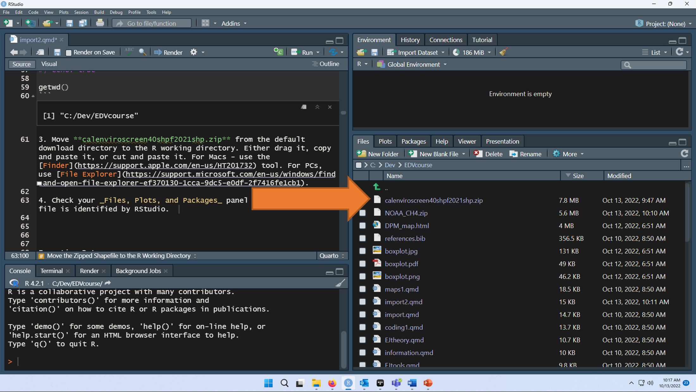
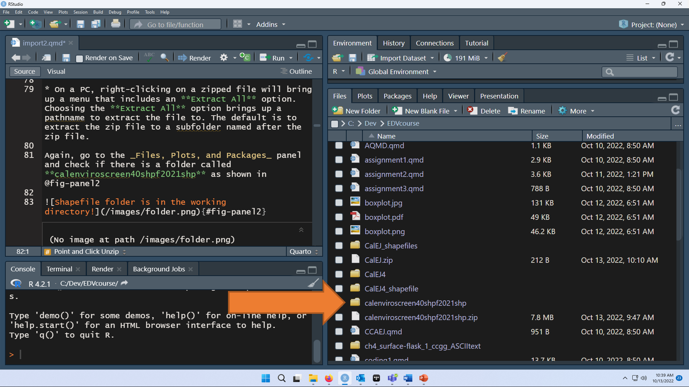

# Importing Data - Part 1 {#sec-import2}

::: {.callout-note appearance="simple"}
Today we will focus on the practice of importing data.
:::

Our framework for the workflow of data visualization is shown in @fig-TidyverseFramework

{#fig-TidyverseFramework}

Acquiring and importing data is the most complicated part of this course and data visualization in general. Most of the work in data visualization is finding the RIGHT dataset to answer a question, importing it, tidying it, and making sure it can be used to answer the question of interest.

## Load and Install Packages

```{r}
#| label: load tidyverse, sf, leaflet
#| echo: true

library(tidyverse) ## 
library(sf)
library(leaflet)

```

## Option 1. Point and Click Download, File Save, Read

The basic way to acquire data is the Point and Click method. This is a step-by-step instruction for doing that.

### Find and Download Data

Go to [CalEnviroScreen](https://oehha.ca.gov/calenviroscreen/report/calenviroscreen-50)

Go to `Data Download`.

There are many choices.  Make sure to download the `shapefile` ending in .shp.

By default, downloads are often placed in a **Downloads** directory, although you may have changed that on your local machine.

::: {.callout-note appearance="simple"}
You can skip the next step if you directly save the zip file to your working directory.
:::

### Move the Zipped Shapefile to the R Working Directory

By default, downloads are often placed in a **Downloads** directory, although you may have changed that on your local machine. If this occurred in your download, the zipped needs to be either (a) moved to the R working directory or (b) identify the filepath of the default download directory and work with it from there.

For today, I will only show path (a) because it is good data science practice to keep the data in a directory associated with the visualization.

1.  Identify the directory where the zipped shapefile was downloaded. On my machine, this is a **Downloads** folder which can be accessed through my web browser after the file download is complete. The name of the file is **calenviroscreen50results_f_070126.shp.zip**.

2.  Identify the R working directory on your machine using the `getwd()` function.

```{r}
#| label: find working directory
#| echo: true

getwd()
wd <- getwd()
```

3.  Move **calenviroscreen50results_f_070126.shp.zip** from the default download directory to the R working directory. Either drag it, copy and paste it, or cut and paste it. For Macs - use the Finder](https://support.apple.com/en-us/HT201732) tool. Here's a [youTube video](https://www.youtube.com/watch?v=0c_sRBgyv-M) on how to move a file - start at 0:27 seconds.

For PCs, use [File Explorer](https://support.microsoft.com/en-us/windows/find-and-open-file-explorer-ef370130-1cca-9dc5-e0df-2f7416fe1cb1).

4.  Check your *Files, Plots, and Packages* panel to see the zipped file is identified by RStudio. See the example in @fig-filesPanel.

{#fig-filesPanel}

If you see the **calenviroscreen50results_f_070126.shp.zip** in the directory on your machine, congratulations! You are a winner!

### Unzip the data - Two Ways

Although the data is in the right place, it is not directly readable while zipped.

#### Point and Click Unzip

I think the process is basically the same for Mac and PC, but we will identify this in class.

-   On a Mac, [Double-click the .zip file](https://support.apple.com/guide/mac-help/zip-and-unzip-files-and-folders-on-mac-mchlp2528/mac). The unzipped item appears in the same folder as the .zip file.

-   On a PC, right-clicking on a zipped file will bring up a menu that includes an **Extract All** option. Choosing the **Extract All** option brings up a pathname to extract the file to. The default is to extract the zip file to a subfolder named after the zip file.

Again, go to the *Files, Plots, and Packages* panel and check if there is a folder called **calenviroscreen50results_f_070126.shp.zip** as shown in @fig-directory. 

{#fig-directory}
  
The `sf` library is used to import geospatial data. As before, `st_read()` is function used to import geospatial files.

Shapefiles are the [**esri**](https://www.esri.com/en-us/home) propietary geospatial format and are very common.

The CalEnviroScreen data are in the shapefile format, which is a bunch of individual files organized in a folder directory. In the **calenviroscreen40shpf2021shp** directory, there are 8 individual files with 8 different file extensions. We can ignore that and just point `read_sf()` at the directory and it will do the rest. The `dsn =` argument stands for *data source name* which can be a directory, file, or a database.

```{r}
#| label: import CalEnviroScreen5.0 dataset
#| echo: true

wd <- getwd()
subdirectory <- 'calenviroscreen50results_f_070126.shp'
CalEJ <- sf::st_read(dsn = subdirectory) |> 
  sf::st_transform(crs = 4326)

```

Check the *Environment* panel after running this line of code. Is there a CalEJ file with 9106 observations of 71 variables present?

If so, success is yours! Let's make a map of Pesticide census tract percentiles to celebrate with @fig-CaliforniaPesticide!

### Visualize the data

The whole California map is too big, so I am just going to show the southernmost counties here by using the `filter` function for a small subset of counties. We'll also remove the tracts with no pesticide information (-999).

```{r}
#| label: import CalEJ southernmost counties
#| echo: true

CalEJ2 <- CalEJ  |>  
  filter(county %in% c('Imperial', 'Riverside', 'San Diego', 'Orange')) |> 
  filter(pestP >=0)

```

```{r}
#| label: fig-CaliforniaPesticide
#| echo: true
#| fig-cap: Pesticide percentile census tracts in Southernmost California
#| eval: true

palPest <- colorNumeric(palette = 'Reds', domain = CalEJ2$pestP)

leaflet(data = CalEJ2) |> 
    addTiles() |> 
    addPolygons(color = ~palPest(pestP),
                fillOpacity = 0.8,
                weight = 1,
                label = ~approx_loc) |> 
    addLegend(pal = palPest,
              title = 'Pesticide (%)', 
              values = ~pestP)
```

## Option 2 - Directly Read the Dataset

[Methane monthly average concentrations sampled by flasks](https://gml.noaa.gov/dv/data/index.php?category=Greenhouse%2BGases&parameter_name=Methane&frequency=Monthly%2BAverages&type=Flask)

Today I am selecting Mauna Loa (MLO) in Hawaii. Methane's chemical formula is CH~4~. Therefore, I will assign the path of URL.MLO.CH4

```{r}
#| label: URL for Mauna Loa methane monthly averages
#| echo: TRUE

URL.MLO.CH4 <- file.path( 'https://gml.noaa.gov/aftp/data/trace_gases/ch4/flask/surface/txt/ch4_mlo_surface-flask_1_ccgg_month.txt')
```

Let's try the successful code using the `read_table()` function. Note, that when I follow the url to the raw data, the first line of the dataset says there are **71 header lines**.

```{r}
#| label: MLO methane monthly average import 2
#| echo: TRUE

MLO.CH4 <- read_table(URL.MLO.CH4, skip = 71)

head(MLO.CH4)
```

```{r}
#| label: MLO methane headers fix
#| echo: TRUE

headers <- c('site', 'year', 'month', 'value')
colnames(MLO.CH4) <- headers

head(MLO.CH4)
```

This is better.

We can now visualize the data in @fig-MLOMethaneTrend.

```{r}
#| label: fig-MLOMethaneTrend
#| fig-cap: Trend in Methane concentrations (ppb) at Mauna Loa, Hawaii
#| echo: TRUE

MLO.CH4 |> 
  mutate(decimal.Date = (year + month/12)) |> 
  ggplot(aes(x = decimal.Date, y = value)) +
  geom_point() +
  geom_line(alpha = 0.6) +
  geom_smooth() +
  theme_bw() +
  labs(x = 'Year', y = 'Methane concentration (ppb)',
       title = 'Mauna Loa - methane concentration trend')
```

### Advanced data visualization

Now that we have data from Mauna Loa, I want to add the [Alert, Nunavut Canada](https://gml.noaa.gov/dv/site/ALT.html) site location to it. This code downloads the Alert dataset and renames its headers.

```{r}
#| label: URL for Alert methane monthly averages
#| echo: TRUE

URL.ALT.CH4 <- file.path( 'https://gml.noaa.gov/aftp/data/trace_gases/ch4/flask/surface/txt/ch4_alt_surface-flask_1_ccgg_month.txt')
ALT.CH4 <- read_table(URL.ALT.CH4, skip = 70)
colnames(ALT.CH4) <- headers

```

Now we can put the datasets together to make a combined visualization. The `bind_rows()` function from `tidyverse` let's us put the datasets take together since they have the same headers. Then we can use the `color` argument to `aes()` to get two separate time series as shown in @fig-bothTrend. I also grouped the data by the shape of the symbol to ensure that the two datasets are distinguishable.

```{r}
#| label: fig-bothTrend
#| fig-cap: Trend in Methane concentrations (ppb) at Mauna Loa, Hawaii and Alert, Canada
#| echo: TRUE
CH4 <- bind_rows(ALT.CH4, MLO.CH4)

CH4 |> 
  mutate(decimal.Date = (year + month/12)) |> 
  ggplot(aes(x = decimal.Date, y = value, color = site, shape = site)) +
  geom_point() +
  geom_line(alpha = 0.6) +
  #geom_smooth(se = FALSE) +
  theme_bw() +
  labs(x = 'Year', y = 'Methane concentration (ppb)',
       title = 'Methane trend')

```

## 30x30 California - Conservation areas

One major California initiative for conservation is called [30x30](https://www.californianature.ca.gov/), which is a goal to conserve 30% of California land and coastal waters by 2030.  

This project has a great conservation dataset for greenspace.  

- go to `Open Data` tab
- select `Conserved` subject area 
- select the [30x30 Conserved Areas, Terrestrial (2025)](https://www.californianature.ca.gov/search?categories=%252Fcategories%252Fconserved%2520areas) dataset.  

The dataset can be filtered by Counties to make the dataset more manageable.


