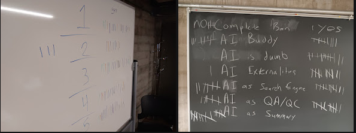

# Course Syllabus {#sec-appendix-syllabus}

## Course Description

This is an introductory course on the theory and practice of effective communication with quantitative data. This course will introduce the theory of data visualization, discuss the ethics of data visualization, provide hands-on training in acquiring, tidying, and visualizing quantitative environmental data, and critically examine current environmental justice tools (CalEnviroScreen, EPA's EJScreen, CEJST).

## Course Materials

Go [here](http://radicalresearch.llc/EA078_Fall2026) to see all course materials.

The course materials are built using the [quarto](https://quarto.org/docs/guide) environment which is [R Markdown](https://rmarkdown.rstudio.com/) adjacent, but allows a user to embed functional code in R, Python, Julia, and/or Observable JS.

All code used is on [github](https://github.com/RadicalResearchLLC/)

Any readings assigned will be linked, emailed, and/or posted to Canvas. 

::: {.callout-note appearance="simple"}
Course layout and materials listed on course materials page are subject to change due to shifting conditions that occur during the course of the semester. I will update course materials on a weekly basis to reflect the changing conditions and expectations throughout the semester.  
:::


## Course Goals & Learning Objectives

Upon successful completion of this course, students will

-   acquire critical thinking skills on the display of visual information
-   know how to acquire, [tidy](https://www.tidyverse.org/), and summarize quantitative environmental datasets
-   create graphs and maps in [R](https://cran.r-project.org/)
-   critically review current environmental justice tools such as [CalEnviroScreen](https://oehha.ca.gov/calenviroscreen/report/calenviroscreen-50) and [EJScreen](https://screening-tools.com/epa-ejscreen)
-   understand basic theory and ethics of environmental data visualization


## Student Learning Outcomes

1.  Critical Thinking, Quantitative Reasoning, and Effective Expression - Upon completion of this course, student's will be able to critically examine the elements of environmental data visualization, create effective maps and graphs of environmental data, and effectively communicate environmental ideas in a quantitative visual manner. It will also focus on the theory and ethics of data visualization with readings and critical analysis of existing environmental justice tools. Ethical use of AI 

2.  Social Justice Theory - This course will identify and quantitatively explore the unequal distribution and access to natural resources (Environmental Justice) within California and the United States. Students will critically examine the ways Environmental Justice is currently characterized by US government agencies and describe the types of data visualization used to quantitatively identify areas of disproportional impact and understand the limitations of existing tools in promoting effective change.

## Classroom Approach

In-person class time will include approximately time to devoted to lectures, hands-on coding and data visualization, and discussion.

## Assignments and Activities

-   Classroom participation during discussion sections
-   Classroom participation during coding sessions
-   Assigned reading (news and peer-review articles, online books)
-   Assigned review of web tools (CalEnviroScreen, EJScreen, CEJST)
-   Group coding projects
-   Class presentation on an environmental data visualization
-   Individual projects generating, displaying, or critiquing environmental data visualizations
-   Group project creating an environmental data visualization

## Grading and Assessment Breakdown

The class will be based on a total of 1000 points.

@tbl-scores

```{r}
#| label: tbl-scores
#| tbl-cap: Breakdown of course points
#| echo: false
#| warning: false
Assignments <- c('Individual project 1 - written critique of existing visualization', 
                 'Individual project 2 - class discussion of visualization',
                'Individual Project 3 - - EJ tool remix',
                'Individual Project 4 - data visualization',
                'Group Project - individual prototype',
                'Group Project - Presentation of plan',
                'Group Project - final visualization', 
                'Classroom participation',
                'Extra Credit')
Points <- c(100, 100, 100, 200, 100, 150, 150, 100, 50)
table.score <- data.frame(Assignments, Points)
kableExtra::kable(table.score)
```

-   Classroom participation will count for 100 points throughout the course of the semester. These points will be awarded for attendance and active participation in classroom discussion and coding sessions. Online attendance and participation will count towards this activity in case of sickness or inability to attend in-person.
-   Missing classroom discussion and coding sessions can be made up for 80% credit within two weeks or 50% credit within four weeks by attending online or in-person office hours.
-   Extra credit - Identifying errors in course lectures, asking questions of guest speakers, and bringing snacks to enhance class morale can earn extra credit in 10 point chunks.

Students get a single **free** individual or group project that can be late by up to seven days from the due date. For the group project, if a member of the group has already used their individual **free** late project, the group cannot use other individual free periods. If any other project is late, scores will be reduced by 10% per day beyond the due date of the project.

The assigned presentation date requires a doctor's note for an excused absence. If unexcused, the student can make up the presentation or final exam for 75% credit within one week of the assigned date.

This course will be attempting to engage in *ungrading* to give scholars more control over their own review of their progress and success in the class. The goal is for internal motivation and ownership of the definition of classroom success. In practice, ungrading is essentially an agreement to allow students to redo and resubmit assignments up until the last day of class. This requires students to communicate in writing that the intent is to resubmit an assignment within 10 days of receiving the initial grade. Late assignment penalties will still apply.

## Office Hours
   
-   Monday 9:00 - 9:30 (before class - in classroom)
-   Tuesday 11:00 - 12:00 [zoom](https://pitzer.zoom.us/j/2600893680) 
-   Wednesday at 9:00 - 9:30 (before class) - in classroom
-   Friday 9:00 - 10:00 [zoom](https://pitzer.zoom.us/j/2600893680)

## Contact Info

The best way to get a hold of me is email: michael_mccarthy\@pitzer.edu You are also likely to see emails from my non-pitzer email: mikem\@radicalresearch.llc

## Course materials

All course materials will be hosted on [github](https://github.com/RadicalResearchLLC/EA078_Fall2026).

Go [here](http://radicalresearch.llc/EA078_Fall2026/) to see all course materials.

## Sickness policy

Please read Pitzer's [COVID Policies](https://live-pitzer-college.pantheonsite.io/covid-19-policies).  

If we do have a COVID breakout or otherwise require hybrid/remote class environments through Zoom, I will post meeting links via email. If you are sick and potentially contagious, please do not come to class.  Video conference hybrid classes can be held upon request for students who are contagious and avoiding the classroom.  

## AI Policy

AI Policy was discussed with EA078 Scholars on September 1, 2026.  Classroom votes on policy planks are shown in #fig-AIvotes.  

{#fig-AIVotes}

All suggested recommendations by Pitzer Student Senate are adopted.  

**Recommendation 1** - This class defines and discusses policy on generative AI in the syllabus. Generative AI is allowed in specific use cases defined below in Planks.  

**Recommendation 2** - Course materials generated in this course *currently* do not use Generative AI. If any Generative AI is used, it will be explicitly identified, cited, and tested. It will be labeled as **Generative AI** within the section and subsection headers.  

**Recommendation 3** - This course will include education on AI, LLMs, and/or Media Generators, including impacts on environment and potential social impacts to critically examine impacts.  See Plank 2 for details.

**Recommendation 4** - AI will not be used in grading in this course.

**Recommendation 5** - Students should not outsource their education to AI because of the dissonance with the Pitzer mission emphasizing the human experience.  

**Plank 1** - Generative AI is dumb (13 Aye - 0 No - 9 abstain). It is a probabilistic tool that has no specific domain knowledge.  Use AI with the understanding that it is an average guess of the answer for any given query using the combined material it was trained on. It mirrors the bias, ignorance, and knowledge of people. Evaluate its answers as critically as any other source.  

**Plank 2** - Generative AI is allowed as a topic of study (12 Aye - 1 No - 9 abstain), especially for analysis of its environmental impacts and the data visualizations being used to communicate its impacts for energy, water, air pollution, and other negative externalities.  

**Plank 3** - Generative AI is permitted for the use case of search engine (12 Aye - 7 No - 3 abstain), but must be cited as a tool.  Primary sources should be checked and the AI summary is not allowed to be copy-pased as a work product.  

**Plank 4** - Generative AI is not permitted for the use case of QA/QC checks (11 Aye - 6 No - 6 abstain). Student work products should not be submitted to AI in draft or final form but may be submitted to other students or the Professor.

**Plank 5** - Generative AI is not permitted for use as a Summarizer (0 Aye - 15 No - 7 abstain).  AI should not be used to read, critically evaluate, or provide synopsis of longer form material.  

**Plank 6** - Generative AI is not permitted for use as a Buddy to bounce ideas off of (8 Aye - 8 No - 6 abstain). Human-to-human buddy interactions are allowed and encouraged.  


## RRC Access Policy Form

Please fill out this [form](https://pitzer.app.box.com/sign/ready-sign-link/dccea3b9-cef4-4d4b-a8af-070946083a5c).

## Readings

The theory of environmental data visualization will use selected readings assigned to students. Every other class will involve a discussion of an assigned reading or analysis of an environmental data visualization.

Assigned readings will include selections from books, peer-review journal articles, websites, and newspaper articles. A selection of readings that are likely to be discussed in the course includes:

-   Selections from Tufte's book 'The Visual Display of Quantitative Information' [@tufteVisualDisplayQuantitative2001]
-   Selections from Tufte's book 'Envisioning Information' [@tufteEnvisioningInformation2013]
-   Selections from Hadley Wickham's "Grammar of Graphics" with ggplot2, shiny, and other R packages. [@wickhamWelcomeTidyverse2019]
-   A selection of Peer-review journal articles listed in the references below. [@hortonEnhancingOperationalValue2020; @kelleherTenGuidelinesEffective2011; @vanbeekEnvironmentalVisualizationsFraming2020; @gommehVisualDiscourseCoalitions2021; @murchieFundamentalsGraphicDesign2020; @graingerEnvironmentalDataVisualisation2016]
-   Newspaper articles such as the LA Times article by Professor Phillips on Inland Empire Warehouse growth [@facebookOpEdWeMapped2022]
-   Readings on the meaning, use, and technical limitations of Environmental Justice tools
