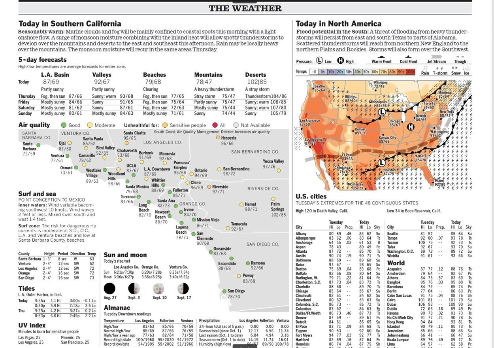
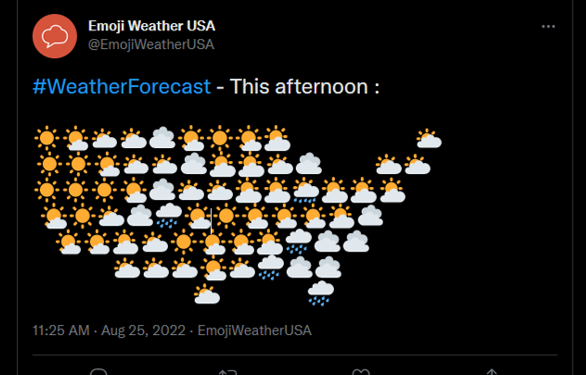
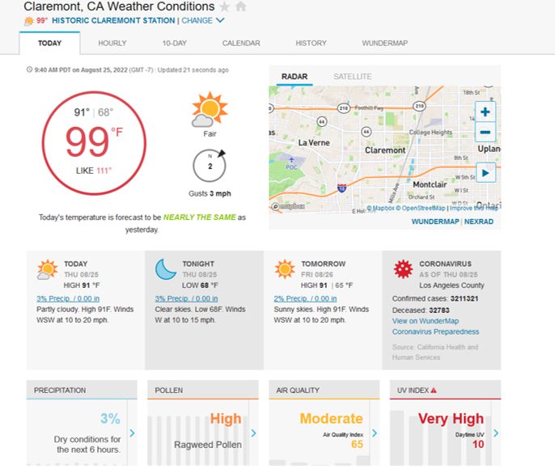

# Unit 1: Introduction to Data Visualization {#sec-weather}

The most common environmental dataset that people encounter is the weather. Every major type of media devotes time to the weather: newspapers, [news shows](https://www.youtube.com/watch?v=gTol-2-Iwio), [apps](https://www.wunderground.com/), [twitter](https://twitter.com/EmojiWeatherUSA?lang=en) [bots](https://twitter.com/laxweatherbot), and [The Weather Channel](https://weather.com/).

It is a great example for us to start talking about environmental data. Additionally, the weather is often confused for the climate. Given the existential threat of Climate Change, we'll explore, replicate, and maybe improve some climate visualizations.

### Comparative Analysis

Examine @fig-WeatherMap1 from the [Los Angeles Times](https://www.latimes.com), a [Twitter emoji weather map](https://twitter.com/EmojiWeatherUSA?lang=en), and a screenshot from [Wunderground](https://www.wunderground.com).

::: {.callout-note appearance="simple"}
What are your impressions of these different visualizations?
:::

{#fig-WeatherMap1}

{#fig-emojiMap}

{#fig-Wunderground}
